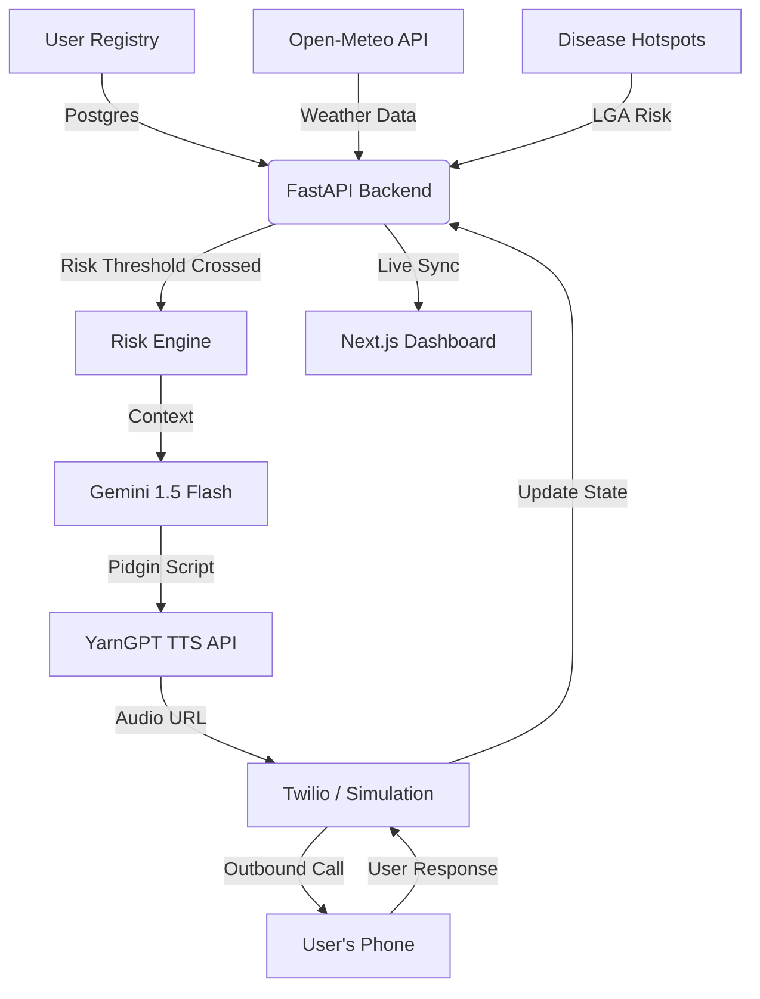

# Sabi Health: Proactive Voice AI for Preventive Public Health 🩺🤖

> **"Your AI neighbor that calls before sickness catches you."**

Sabi Health is a proactive health guardian designed to bridge the gap between technical public health bulletins and actionable community prevention. In many regions, healthcare is **reactive**—people seek help only after symptoms become severe. Sabi Health shifts this paradigm using environmental data, epidemiological insights, and culturally resonant Voice AI.

---

## 🚀 The Core Innovation

### 1. Multi-Layered Risk Engine
Sabi Health doesn't wait for a manual trigger. It autonomously monitors:
- **Environmental Data**: Integrates with the **Open-Meteo API** to track rainfall and humidity. High rainfall (>15mm) automatically triggers malaria prevention alerts.
- **Epidemiological Tracking**: Monitors LGA-level disease hotspots (Mock NCDC data) for outbreaks like Lassa Fever.

### 2. Culturally Resonant Generative AI
Using **Google Gemini 1.5 Flash**, the system converts data points into personalized, neighborly advice delivered in authentic **Nigerian Pidgin**. 
> *"Abeg, make sure say you cover your food well well, so rat no go touch am. Disease for Kano don high now."*

### 3. Voice-First Accessibility
Designed for total inclusivity, the system prioritizes **Voice** for users with basic feature phones or limited literacy.
- **Natural TTS**: Uses **YarnGPT** to deliver scripts in natural Nigerian accents (e.g., "Idera" voice).
- **Outbound Telephony**: Integrated with **Twilio**, delivering real calls that users can respond to (DTMF).

---

## 🏗️ Technical Architecture



---

## ⚖️ Judging Criteria Alignment

| Criteria | Achievement |
| :--- | :--- |
| **Technology** | Robust **Async FastAPI** backend, **PostgreSQL**, and seamless integration of 4+ external APIs (Weather, AI, Voice, Telephony). |
| **Design** | Premium **Tailwind v4** dashboard with real-time health scoring and AI call simulation for accessibility testing. |
| **Impact** | Addresses a multi-billion dollar economic burden by reducing hospitalizations via proactive malaria and Lassa fever prevention. |
| **Innovation** | First-of-its-kind use of Pidgin-speaking LLMs for automated public health outreach. |

---

## 💻 Tech Stack
- **Backend**: Python (FastAPI), SQLAlchemy, PostgreSQL, Pydantic.
- **Frontend**: Next.js (App Router), Tailwind CSS v4, Radix UI, Motion.
- **AI/ML**: Google Gemini 1.5 Flash, YarnGPT (Nigerian Accent TTS).
- **Infrastructure**: Twilio API (Outbound Voice).

---

## 🏃‍♂️ Quick Start

### 1. Backend Setup
```bash
cd backend
pip install -r requirements.txt
# Configure .env with GOOGLE_API_KEY and YARNGPT_API_KEY
python main.py
```

### 2. Frontend Setup
```bash
cd frontend
npm install
npm run dev
```

### 3. Experience the Proactive Shift
Register an account, select an LGA like **Kano**, and use the **"Test AI Alert"** button to witness how the system generates a tailored voice message and initiates a preventive call.

---
*Developed for the Cavista Hackathon 2026. Making health prevention as simple as a phone call.*
