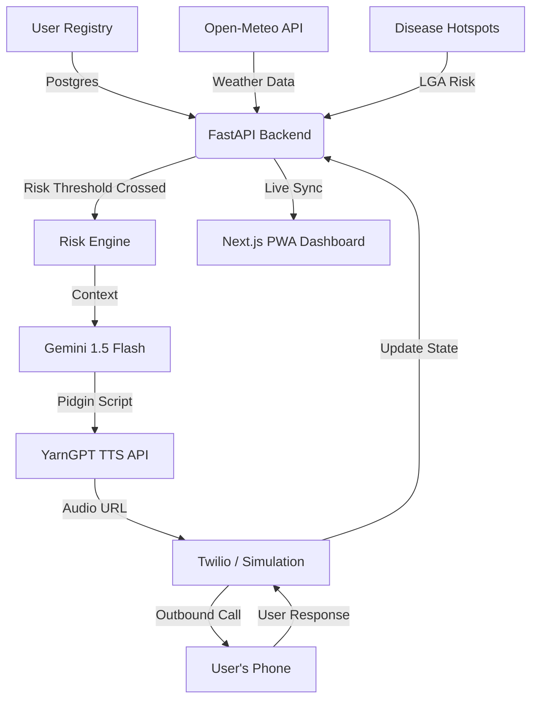

# Sabi Health: Proactive Voice AI for Preventive Public Health 🩺🤖

> **"Your AI neighbor that calls before sickness catches you."**

Sabi Health is a proactive health guardian designed to bridge the gap between technical public health bulletins and actionable community prevention. In many regions, healthcare is **reactive**—people seek help only after symptoms become severe. Sabi Health shifts this paradigm using environmental data, epidemiological insights, and culturally resonant Voice AI.

---

## 👵 Special Mission: Inclusivity & The "Desperate" Gap
Sabi Health is intentionally built for the most vulnerable members of society:
- **The Elderly**: Those who may struggle with small screens, complex apps, or digital literacy. Our **Voice-First** approach means they don't need to "use" an app—they just answer their phone and listen to a friendly voice.
- **Low-Literacy Communities**: Information is delivered in **authentic Nigerian Pidgin**, removing the barrier of formal language.
- **Low-Connectivity Areas**: As a **PWA**, Sabi Health works offline and on low-end devices, ensuring that desperate health warnings reach those who need them most, regardless of their technology.

---

## 🧠 Sabi Intelligence: The Business Logic
For judges evaluating the core innovation, Sabi Health operates on a three-tier intelligence system:

### 1. Multi-Layered Risk Engine (Autonomous)
The system doesn't wait for a user to report a cough. It's an **Active Watchman**:
- **Environmental Vigilance**: Integrated with **Open-Meteo API**, it monitors rainfall and humidity. High rainfall triggers immediate malaria and cholera prevention protocols.
- **Epidemiological Hotspots**: Tracks LGA-level disease outbreaks (Lassa Fever, Cholera) using historical and real-time hotspot data.

### 2. Symptom-Driven Guardian (Personalized)
When a user logs symptoms (fever, fatigue, etc.), the logic kicks in:
- **Dynamic Health Scoring**: A real-time proprietary algorithm calculates a health score (0-100) based on risk factors and symptoms.
- **Instant Triage**: If signs point to high risk (e.g., Fever + Heavy Rain LGA), the system provides **nearest health center mapping** and custom recommendations.

### 3. Predictive Health Forecasting (AI-Driven)
Beyond today, Sabi Health looks at tomorrow:
- **Weekly Outlooks**: Uses Gemini 1.5 Flash to synthesize weather trends and local health data into a **High/Medium/Low risk forecast** for the coming week.

---

## 🚀 The Core Innovation

### 1. Culturally Resonant Generative AI
Using **Google Gemini 1.5 Flash**, the system converts data points into personalized, neighborly advice delivered in authentic **Nigerian Pidgin**. 
> *"Abeg, make sure say you cover your food well well, so rat no go touch am. Disease for Kano don high now."*

### 2. Natural Voice-First TTS
Uses **YarnGPT** to deliver scripts in natural Nigerian accents (e.g., "Idera" voice), making the AI feel like a trusted community member rather than a cold computer.

### 3. Outbound Telephony
Integrated with **Twilio**, delivering real calls that users can respond to via voice or keypad (DTMF).

---

## 🏗️ Technical Architecture



---

## 💻 Tech Stack
- **Backend**: Python (**FastAPI**), SQLAlchemy (Async), **PostgreSQL**, Pydantic.
- **Frontend**: **Next.js 15 (App Router)**, **Tailwind CSS v4** (Modern aesthetic), **Framer Motion** (Smooth UI transitions).
- **AI/ML**: **Google Gemini 1.5 Flash** (Script gen & Chat), **YarnGPT** (Nigerian Accent TTS).
- **Inclusivity**: **PWA** (@ducanh2912/next-pwa) for offline resilience and home-screen installability.
- **Infrastructure**: **Twilio API** for real-world telephony.

---

## ⚖️  Alignment

| Criteria | Achievement |
| :--- | :--- |
| **Technology** | Robust **Async FastAPI** backend, **PostgreSQL**, and seamless integration of 4+ external APIs (Weather, AI, Voice, Telephony). |
| **Design** | Premium **Tailwind v4** dashboard with interactive health scoring and AI call simulation. |
| **Impact** | Direct intervention for the elderly and underserved by removing technical/literacy barriers to health information. |
| **Innovation** | First-of-its-kind use of Pidgin-speaking LLMs for automated, proactive public health outreach. |

---

## 🏃‍♂️ Quick Start

### 1. Backend Setup
```bash
cd backend
pip install -r requirements.txt
# Configure .env with GOOGLE_API_KEY, YARNGPT_API_KEY, TWILIO_SID/TOKEN
python main.py
```

### 2. Frontend Setup
```bash
cd frontend
npm install
npm run dev
```

### 3. Proactive Experience
Register, select an LGA like **Kano**, and use the **"Test AI Alert"** button to witness the end-to-end flow from data analysis to a localized voice message.

---
*Developed for the Cavista Hackathon 2026. Making health prevention as simple as a phone call.*
